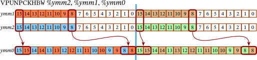
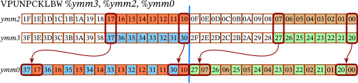
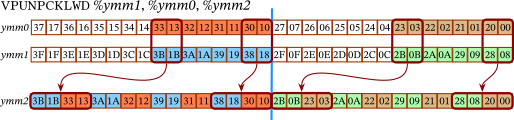
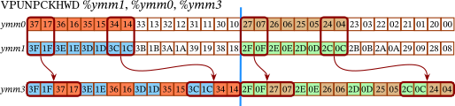

# Bare-Metal AVX2 Matrix Transpose (16x16 Byte)

This repository contains a bare-metal AVX2 implementation of a 16x16-byte matrix
transposition.

The algorithm shows roughly a 5x performance gain compared to a naive scalar
baseline implementation, even though the entire working set fits in L1 cache.
Hardware profiling reveals that when an algorithm is dominated by memory
operations, the load/store unit throughput becomes the bottleneck, regardless
of cache residency.

This AVX2 implementation bypasses the load/store port limitations by absorbing
the entire matrix into 256-bit registers. Executing the transposition purely
through vector unpacks eliminates memory stalls and maximizes throughput
to the theoretical limit of the silicon.

## Highlights

 * 44 core cycles, bounded entirely by the vector unpack execution units (ports 1 and 5).
 * 8 loads and 8 stores, with zero Store Buffer stalls.
 * Beats [Zemtsov's SSSE3 baseline](https://pzemtsov.github.io/2014/10/01/how-to-transpose-a-16x16-matrix.html)
   algorithm both in the CPU cycles and the number of uops.

## Performance Telemetry (Intel i9-12900H P-Core)

| Counter | SIMD | [Zemtsov's SSSE3 baseline](https://pzemtsov.github.io/2014/10/01/how-to-transpose-a-16x16-matrix.html) | Naive (Clang) | Naive (GCC) |
|---------|------:|------:|------:|------:|
| instructions | 89 | 144 | 482 | 748 |
| core cycles | $\textcolor{green}{\text{𝟰𝟰}}$ | $\textcolor{red}{\text{𝟰𝟴}}$ | $\textcolor{red}{\text{𝟮𝟭𝟲}}$ | $\textcolor{red}{\text{𝟮𝟭𝟳}}$ |
| uops_issued.any | 89 | 144 | 481 | 748 |
| uops_retired.slots | 89 | 144 | 481 | 748 |
| resource_stalls.sb | $\textcolor{green}{\text{𝟬}}$ | $\textcolor{green}{\text{𝟬}}$ | $\textcolor{red}{\text{𝟭𝟯𝟱}}$ | $\textcolor{red}{\text{𝟵𝟮}}$ |
| uops_dispatched.port_0 | 0 | 0 | 0 | 40 |
| uops_dispatched.port_1 | 32 | 48 | 0 | 30 |
| uops_dispatched.port_2_3_10 | $\textcolor{green}{\text{𝟵}}$ | $\textcolor{red}{\text{𝟮𝟯}}$ | $\textcolor{red}{\text{𝟮𝟰𝟬}}$ | $\textcolor{red}{\text{𝟮𝟰𝟭}}$ |
| uops_dispatched.port_4_9 | $\textcolor{green}{\text{𝟵}}$ | $\textcolor{red}{\text{𝟮𝟮}}$ | $\textcolor{red}{\text{𝟮𝟰𝟬}}$ | $\textcolor{red}{\text{𝟮𝟰𝟮}}$ |
| uops_dispatched.port_5_11 | 32 | 48 | 0 | 66 |

## Contents

 * `simdtrans.s` The AVX2 assembly implementation.
 * `mtxtrans.cpp` The libpfc C++ benchmarking harness configured for Golden Cove PMU events.

## Brief Algorithm Description

The algorithm is a cascade of unpacks. Each stage of the cascade turns
vertically adjacent elements into horizontally adjacent ones, at progressively
wider widths: bytes, words, and dwords. The side effect is that each stage also
scrambles the ordering within the register, but since later stages don't depend
on a particular ordering, only on the correct grouping, the scrambling is
harmless. We could have corrected the order between stages to keep the right
matrix structure, but that would incur extra CPU cycles. Instead, we let the
reordering accumulate. The final unpack corrects the ordering in one step.

## Detailed Algorithm Description

Let's consider the following 16×16 matrix and assume it's stored in row-major order.

$$
\begin{pmatrix}
    00 &01 &02 &03 &04 &05 &06 &07 &08 &09 &0a &0b &0c &0d &0e &0f\\
    10 &11 &12 &13 &14 &15 &16 &17 &18 &19 &1a &1b &1c &1d &1e &1f\\
    20 &21 &22 &23 &24 &25 &26 &27 &28 &29 &2a &2b &2c &2d &2e &2f\\
    30 &31 &32 &33 &34 &35 &36 &37 &38 &39 &3a &3b &3c &3d &3e &3f\\
    40 &41 &42 &43 &44 &45 &46 &47 &48 &49 &4a &4b &4c &4d &4e &4f\\
    50 &51 &52 &53 &54 &55 &56 &57 &58 &59 &5a &5b &5c &5d &5e &5f\\
    60 &61 &62 &63 &64 &65 &66 &67 &68 &69 &6a &6b &6c &6d &6e &6f\\
    70 &71 &72 &73 &74 &75 &76 &77 &78 &79 &7a &7b &7c &7d &7e &7f\\
    80 &81 &82 &83 &84 &85 &86 &87 &88 &89 &8a &8b &8c &8d &8e &8f\\
    90 &91 &92 &93 &94 &95 &96 &97 &98 &99 &9a &9b &9c &9d &9e &9f\\
    a0 &a1 &a2 &a3 &a4 &a5 &a6 &a7 &a8 &a9 &aa &ab &ac &ad &ae &af\\
    b0 &b1 &b2 &b3 &b4 &b5 &b6 &b7 &b8 &b9 &ba &bb &bc &bd &be &bf\\
    c0 &c1 &c2 &c3 &c4 &c5 &c6 &c7 &c8 &c9 &ca &cb &cc &cd &ce &cf\\
    d0 &d1 &d2 &d3 &d4 &d5 &d6 &d7 &d8 &d9 &da &db &dc &dd &de &df\\
    e0 &e1 &e2 &e3 &e4 &e5 &e6 &e7 &e8 &e9 &ea &eb &ec &ed &ee &ef\\
    f0 &f1 &f2 &f3 &f4 &f5 &f6 &f7 &f8 &f9 &fa &fb &fc &fd &fe &ff\\
\end{pmatrix}
$$

A canonical way to transpose it in-place in $\log{16} = 4$ parallel stages was
described by Eklundh [[1]](#references). First, we exchange bytes in every pair
of rows, turning vertical pairs of bytes into horizontal:

$$
\begin{pmatrix}
    00 &10 &02 &12 &\cdots &0c &1c &0e &1e\\
    01 &11 &03 &13 &\cdots &0d &1d &0f &1f\\
    20 &30 &22 &32 &\cdots &2c &3c &2e &3e\\
    21 &31 &23 &33 &\cdots &2d &3d &2f &3f\\
    \vdots &\vdots &\vdots &\vdots & &\vdots &\vdots &\vdots &\vdots\\
    c0 &d0 &c2 &d2 &\cdots &cc &dc &ce &de\\
    c1 &d1 &c3 &d3 &\cdots &cd &dd &cf &df\\
    e0 &f0 &e2 &f2 &\cdots &ec &fc &ee &fe\\
    e1 &f1 &e3 &f3 &\cdots &ed &fd &ef &ff\\
\end{pmatrix}
$$

We can express the exchange with the following non-parallel code
```cpp
for (auto i = 0; 16 > i; i += 2) {
    for (auto j = 0; 16 > j; j += 2) {
        std::swap(mtx[i * 16 + j + 1], mtx[(i + 1) * 16 + j]);
    }
}
```

Next, we exchange words (couples of bytes). The pattern of pairing rows for
exchange will be more complicated. We will divide rows into groups of four and
will pair every other row. For example, row $4 i$ will exchange words with row
$4 i + 2$, and row $4 i + 1$ with $4 i + 3$.
```cpp
for (auto i = 0; 16 > i; i += 4) {
    for (auto j = 0; 16 > j; j += 4) {
        std::swap(mtx[i * N + j + 2], mtx[(i + 2) * N + j]);
        std::swap(mtx[i * N + j + 3], mtx[(i + 2) * N + j + 1]);
        std::swap(mtx[(i + 1) * N + j + 2], mtx[(i + 3) * N + j]);
        std::swap(mtx[(i + 1) * N + j + 3], mtx[(i + 3) * N + j + 1]);
    }
}
```

We will get the following result

$$
\begin{pmatrix}
    00 &10 &20 &30 &\cdots &0c &1c &2c &3c\\
    01 &11 &21 &31 &\cdots &0d &1d &2d &3d\\
    02 &12 &22 &32 &\cdots &0e &1e &2e &3e\\
    03 &13 &23 &33 &\cdots &0f &1f &2f &3f\\
    \vdots &\vdots &\vdots &\vdots & &\vdots &\vdots &\vdots &\vdots\\
    c0 &d0 &e0 &f0 &\cdots &cc &dc &ec &fc\\
    c1 &d1 &e1 &f1 &\cdots &cd &dd &ed &fd\\
    c2 &d2 &e2 &f2 &\cdots &ce &de &ee &fe\\
    c3 &d3 &e3 &f3 &\cdots &cf &df &ef &ff\\
\end{pmatrix}
$$

You can see the emerging pattern; we now have 4×4 transposed blocks. If
we continue the process with double words, we will get 8×8 transposed
blocks. Finally, exchanging the quadruple words will yield a transposed matrix.

AVX has a perfect set of commands for this type of exchange: `vpunpck...`. They
do almost what we need: they take a couple of numbers from two registers, stick
them together and store in a third register. For example, here is what
`vpunpcklbw` does (every cell is one byte),


and the corresponding `vpunpckhbw`,



If we apply `vpunpcklbw` and `vpunpckhbw`, to the first four rows of our matrix,

```gas
vmovdqa        (%rdi), %ymm2
vmovdqa    0x20(%rdi), %ymm3
vpunpcklbw      %ymm3, %ymm2, %ymm0
vpunpckhbw      %ymm3, %ymm2, %ymm1
vmovdqa         %ymm0, 0x00(%rdi)
vmovdqa         %ymm1, 0x20(%rdi)
```




We will get

$$
\begin{pmatrix}
    00 &20 &01 &21 &02 &22 &03 &23 &04 &24 &05 &25 &06 &26 &07 &27\\
    10 &30 &11 &31 &12 &32 &13 &33 &14 &34 &15 &35 &16 &36 &17 &37\\
    08 &28 &09 &29 &0a &2a &0b &2b &0c &2c &0d &2d &0e &2e &0f &2f\\
    18 &38 &19 &39 &1a &3a &1b &3b &1c &3c &1d &3d &1e &3e &1f &3f\\
\end{pmatrix}
$$

We are not quite at the point of switching between the horizontal and vertical
arrangement of bytes yet. We can improve the above by applying `vpunpcklwd` and
`vpunpckhwd`,

```gas
vmovdqa        (%rdi), %ymm2
vmovdqa    0x20(%rdi), %ymm3
vpunpcklbw      %ymm3, %ymm2, %ymm0
vpunpckhbw      %ymm3, %ymm2, %ymm1
vpunpcklwd      %ymm1, %ymm0, %ymm2
vpunpckhwd      %ymm1, %ymm0, %ymm3
vmovdqa         %ymm2, 0x00(%rdi)
vmovdqa         %ymm3, 0x20(%rdi)
```





we will get

$$
\begin{pmatrix}
    00 &20 &08 &28 &01 &21 &09 &29 &02 &22 &0a &2a &03 &23 &0b &2b\\
    10 &30 &18 &38 &11 &31 &19 &39 &12 &32 &1a &3a &13 &33 &1b &3b\\
    04 &24 &0c &2c &05 &25 &0d &2d &06 &26 &0e &2e &07 &27 &0f &2f\\
    14 &34 &1c &3c &15 &35 &1d &3d &16 &36 &1e &3e &17 &37 &1f &3f\\
\end{pmatrix}
$$

We can see that bytes that were arranged vertically now are arranged
horizontally. With one caveat: the arrangement skips some elements. For example,
00 and 20 used to be one above another, but there was 10 between them. Now they are
horizontally adjacent.

We can try to shuffle elements around to get them in the right order, but this
will take precious CPU cycles. We can avoid it. Here comes the main idea of the
algorithm. Let's ignore the changes in the adjacency! We will continue swaps
with increasing number of bytes like in the classical Eklundh and do the final
arrangement at the very end.

```gas
.macro transpose2x2x1 rfrom:req, offset:req, regto1:req, regto2:req
    vmovdqa    \offset(\rfrom), %ymm2
    vmovdqa    \offset + 0x20(\rfrom), %ymm3

    vpunpcklbw %ymm3, %ymm2, %ymm0
    vpunpckhbw %ymm3, %ymm2, %ymm1

    vpunpcklwd %ymm1, %ymm0, \regto1
    vpunpckhwd %ymm1, %ymm0, \regto2
.endm

.macro transpose2x2x2 r1:req, r2:req
    vpunpcklwd \r2, \r1, %ymm0
    vpunpckhwd \r2, \r1, %ymm1

    vpunpckldq %ymm1, %ymm0, \r1
    vpunpckhdq %ymm1, %ymm0, \r2
.endm

.macro transpose2x2x4 r1:req, r2:req
    vpunpckldq  \r2, \r1, %ymm0
    vpunpckhdq  \r2, \r1, %ymm1

    vpunpcklqdq %ymm1, %ymm0, \r1
    vpunpckhqdq %ymm1, %ymm0, \r2
.endm

transpose2x2x1 %rdi, 0x00, %ymm4,  %ymm5
transpose2x2x1 %rdi, 0x40, %ymm6,  %ymm7
transpose2x2x1 %rdi, 0x80, %ymm8,  %ymm9
transpose2x2x1 %rdi, 0xc0, %ymm10, %ymm11

transpose2x2x2 %ymm4, %ymm6
transpose2x2x2 %ymm5, %ymm7
transpose2x2x2 %ymm8, %ymm10
transpose2x2x2 %ymm9, %ymm11

transpose2x2x4 %ymm4, %ymm8
transpose2x2x4 %ymm5, %ymm9
transpose2x2x4 %ymm6, %ymm10
transpose2x2x4 %ymm7, %ymm11
```
Here is how the current result would have looked if we copied registers from `ymm4` to `ymm11`,

$$
\begin{pmatrix}
    00 &20 &40 &60 &80 &a0 &c0 &e0 &08 &28 &48 &68 &88 &a8 &c8 &e8\\
    10 &30 &50 &70 &90 &b0 &d0 &f0 &18 &38 &58 &78 &98 &b8 &d8 &f8\\
    04 &24 &44 &64 &84 &a4 &c4 &e4 &0c &2c &4c &6c &8c &ac &cc &ec\\
    14 &34 &54 &74 &94 &b4 &d4 &f4 &1c &3c &5c &7c &9c &bc &dc &fc\\
    01 &21 &41 &61 &81 &a1 &c1 &e1 &09 &29 &49 &69 &89 &a9 &c9 &e9\\
    11 &31 &51 &71 &91 &b1 &d1 &f1 &19 &39 &59 &79 &99 &b9 &d9 &f9\\
    05 &25 &45 &65 &85 &a5 &c5 &e5 &0d &2d &4d &6d &8d &ad &cd &ed\\
    15 &35 &55 &75 &95 &b5 &d5 &f5 &1d &3d &5d &7d &9d &bd &dd &fd\\
    02 &22 &42 &62 &82 &a2 &c2 &e2 &0a &2a &4a &6a &8a &aa &ca &ea\\
    12 &32 &52 &72 &92 &b2 &d2 &f2 &1a &3a &5a &7a &9a &ba &da &fa\\
    06 &26 &46 &66 &86 &a6 &c6 &e6 &0e &2e &4e &6e &8e &ae &ce &ee\\
    16 &36 &56 &76 &96 &b6 &d6 &f6 &1e &3e &5e &7e &9e &be &de &fe\\
    03 &23 &43 &63 &83 &a3 &c3 &e3 &0b &2b &4b &6b &8b &ab &cb &eb\\
    13 &33 &53 &73 &93 &b3 &d3 &f3 &1b &3b &5b &7b &9b &bb &db &fb\\
    07 &27 &47 &67 &87 &a7 &c7 &e7 &0f &2f &4f &6f &8f &af &cf &ef\\
    17 &37 &57 &77 &97 &b7 &d7 &f7 &1f &3f &5f &7f &9f &bf &df &ff\\
\end{pmatrix}
$$

We are almost there. Now it's time to overcome the fundamental AVX limitation: the
128-bit barrier. We need to swap the high 128 bits of one ymm register with the low
bits of another. The only way to do it is through an intermediate register.

```gas
# Swap high 128 bits of one ymm register with low 128 bits of another
.macro swaphldqw r1N:req, r2N:req
    vperm2i128 $0x20, %ymm\r2N, %ymm\r1N, %ymm0
    vperm2i128 $0x31, %ymm\r2N, %ymm\r1N, %ymm\r2N
    vmovdqa    %ymm0, %ymm\r1N
.endm
```

Now we can rearrange. For example,
```gas
swaphldqw 4, 6
```

Here is how `ymm4` and `ymm6` will look after this operation.


We can easily fix it with the last set of unpacks

```gas
vpunpcklbw   %ymm6, %ymm4, %ymm1
vmovdqa      %ymm1, 0x00(%rdi)
vpunpcklbw   %ymm10, %ymm8, %ymm1
vmovdqa      %ymm1, 0x20(%rdi)
vpunpcklbw   %ymm7, %ymm5, %ymm1
vmovdqa      %ymm1, 0x40(%rdi)
vpunpcklbw   %ymm11, %ymm9, %ymm1
vmovdqa      %ymm1, 0x60(%rdi)

vpunpckhbw   %ymm6, %ymm4, %ymm1
vmovdqa      %ymm1, 0x80(%rdi)
vpunpckhbw   %ymm10, %ymm8, %ymm1
vmovdqa      %ymm1, 0xa0(%rdi)
vpunpckhbw   %ymm7, %ymm5, %ymm1
vmovdqa      %ymm1, 0xc0(%rdi)
vpunpckhbw   %ymm11, %ymm9, %ymm1
vmovdqa      %ymm1, 0xe0(%rdi)
```

We are done.

## libpfc notes

[libpfc](https://github.com/obilaniu/libpfc) on GitHub is somewhat outdated.
If you compile it for a modern kernel, you might want to change `struct
bin_attribute*` to `const struct bin_attribute*` in the kernel module code. And change this
```c
native_write_msr(addr,
                 (uint32_t)(newVal >>  0),
                 (uint32_t)(newVal >> 32));
```
to
```c
native_write_msr(addr, newVal);
```
Before running the benchmark
```shell
sudo sh -c 'echo 0 > /sys/devices/system/cpu/cpu11/online'
sudo sh -c 'echo 2 > /sys/bus/event_source/devices/cpu_core/rdpmc'
sudo sh -c 'echo 0 > /proc/sys/kernel/nmi_watchdog'
```
The benchmark runs on core 10. You might want to update it in `mtxtrans.cpp`,
along with the line that disables core 11 above, depending on your CPU
architecture.

Also, check the counter codes for your architecture using `perf list --details`.
You may have something different here
```cpp
// BATCH 1
CFG[3] = raw_msr(0xae, 0x01); // uops_issued.any
CFG[4] = raw_msr(0xc2, 0x02); // uops_retired.slots
CFG[5] = raw_msr(0xa2, 0x08); // resource_stalls.sb
CFG[6] = raw_msr(0xB2, 0x01); // uops_dispatched.port_0
```
and here
```cpp
// BATCH 2
CFG[3] = raw_msr(0xb2, 0x02); // uops_dispatched.port_1
CFG[4] = raw_msr(0xb2, 0x04); // uops_dispatched.port_2_3_10
CFG[5] = raw_msr(0xb2, 0x10); // uops_dispatched.port_4_9
CFG[6] = raw_msr(0xb2, 0x20); // uops_dispatched.port_5_11
```

## References

1. J. O. Eklundh, "A Fast Computer Method for Matrix Transposing," in *IEEE Transactions on Computers*, vol. C-21, no. 7, pp. 801-803, July 1972, doi: 10.1109/T-C.1972.223584.
